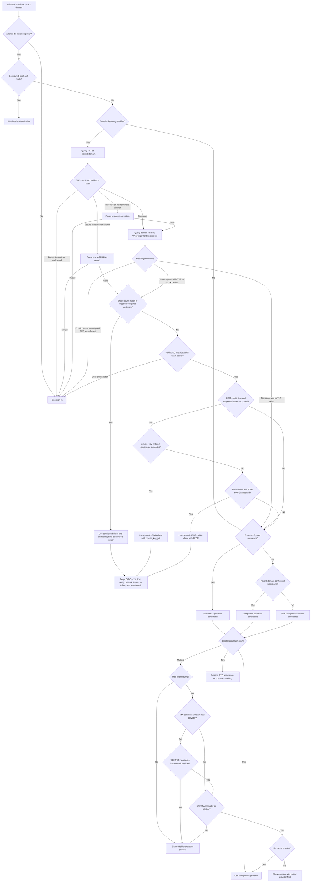

# 0023. Domain discovery and CIMD federation

Status: Proposed
Checked: 2026-10-07
Repository baseline: `5788bda`

## Context

A domain owner should be able to publish an OpenID Connect issuer for its
addresses. The issuer may be a small SAG instance using email OTP or another
provider that supports the required OIDC and CIMD capabilities. A broker SAG
should discover it without bilateral client registration or a shared secret.

For example, `example.org` delegates to `https://idp.example.org`. The hosted
gateway at `https://auth.resoauth.cloud` remains the application's issuer, but
authenticates `jamie@example.org` through the domain's SAG.

There are four separate decisions: locate an issuer, establish its authority
over the requested address, introduce the gateway as a client, and decide what
authentication assurance to accept. CIMD solves the client introduction. It
does not discover the user's issuer, prove software provenance, or establish
authority over an email domain.

### Standards position

| Specification | Status on the checked date | Role here |
| --- | --- | --- |
| [WebFinger, RFC 7033](https://www.rfc-editor.org/rfc/rfc7033.html), and [OIDC Discovery 1.0](https://openid.net/specs/openid-connect-discovery-1_0.html) | Published RFC and final OpenID specification | Existing identifier-to-issuer discovery, then provider metadata. |
| [OAuth server metadata, RFC 8414](https://www.rfc-editor.org/rfc/rfc8414.html) | Published RFC | Endpoints and capabilities once the issuer is known; not domain delegation. |
| [CIMD -02](https://www.ietf.org/archive/id/draft-ietf-oauth-client-id-metadata-document-02.html) | Active OAuth WG Internet-Draft, 6 July 2026; not an RFC | URL client identifiers and fetched client metadata without prior registration. |
| [JWT client authentication updates -11](https://datatracker.ietf.org/doc/html/draft-ietf-oauth-rfc7523bis-11) | Active OAuth WG Internet-Draft, 28 April 2026; not an RFC | Proposes the authorisation server issuer as the sole client-assertion audience. |
| [OpenID Federation 1.1](https://openid.net/specs/openid-federation-1_1.html) and [Federation for OpenID Connect 1.1](https://openid.net/specs/openid-federation-connect-1_1.html) | Final, 5 May 2026; 1.0 was final on 17 February 2026 | Signed trust chains, metadata policy, and automatic client registration for governed federations. Automatic registration uses asymmetric authentication. |
| [DNS-based OIDC Discovery -01](https://datatracker.ietf.org/doc/html/draft-sanz-openid-dns-discovery-01) | Individual draft, last revised April 2018; expired and archived | Defines `_openid` TXT records with `v=OID1;iss=...`. This proposal uses a restricted domain-wide subset, not a current standard. |
| [Dynamic Client Registration, RFC 7591](https://www.rfc-editor.org/rfc/rfc7591.html) | Published RFC | Alternative onboarding with a registration request and server-issued client identifier. |
| [Protected Resource Metadata, RFC 9728](https://www.rfc-editor.org/rfc/rfc9728.html) | Published RFC | An API can advertise its `authorization_servers`; it does not identify the home IdP for an email address. |

The research found no current standard that combines DNS-only email-domain
delegation with CIMD onboarding. This RFC uses the `_openid` name and core
`v=OID1;iss=` syntax from the expired DNS draft, with a narrower profile for
domain-wide email delegation. It does not implement the draft's per-address
`_openidemail` lookup or `clp` claims-provider feature, and does not claim that
the draft is an adopted standard. The protocol adds no SAG-specific DNS tag or
provider metadata requirement.

[URI records, RFC 7553](https://www.rfc-editor.org/rfc/rfc7553.html), can carry
an issuer URL; [SVCB/HTTPS, RFC 9460](https://www.rfc-editor.org/rfc/rfc9460.html),
describe service bindings. Neither supplies this email-domain delegation
contract. TXT is proposed for operational convenience, not stronger security.
Any standards submission should settle the record type and pursue the
appropriate [underscore-name registration](https://www.rfc-editor.org/rfc/rfc8552.html)
and metadata registrations; this repository RFC performs none of them.

### Existing SAG behaviour

The relevant implementation is [upstream routing](../../src/upstream/index.js),
[mail hints](../../src/upstream/dns.js), [client resolution](../../src/clients/index.js),
[discovery](../../src/endpoints/discovery.js), and [OTP policy](../../src/otp.js).

- Static domain and parent-domain routes precede `common` routes and OTP.
  MX/SPF hints choose between already eligible providers; they confer no trust.
- Incoming CIMD exists, but SAG does not publish its own upstream client
  document. Discovery currently uses `urn:sag:client_registration.cimd`, not
  `client_id_metadata_document_supported` from the CIMD draft.
- Upstream code flow already uses PKCE and permits an absent client secret.
  It does not yet send upstream `private_key_jwt` assertions.
- Static upstream metadata can override a discovery document's issuer, and
  domain-specific routes may use `preferred_username` or `upn` when `email` is
  absent. Neither behaviour is permitted for an automatically discovered
  issuer; the stricter checks in section 6 need a separate path.
- `OTP_ALLOWED_DOMAINS=example.org` also accepts subdomains. It is not an
  instance-wide exact-domain restriction.
- [ADR 0011](../adr/0011-subject-derived-from-the-verified-address.md) derives
  ordinary subjects from verified email. [ADR 0019](../adr/0019-a-common-upstream-must-bound-what-it-may-assert.md)
  therefore requires bounds on what an upstream may assert.
- The current [assurance mapper](../../src/acr.js) treats `otp` or multiple
  AMR entries as MFA. A second SAG's email OTP would be over-promoted.

## Proposal

### 1. Scope and trust model

Add opt-in, domain-wide `_openid` discovery of a generic OIDC issuer and CIMD
onboarding of the broker as its client. Version 1 treats a discovered issuer as
authoritative for verified addresses at the delegated domain, whatever software
it runs. Automatic DCR and federation trust-anchor management are outside this
version. Broker chains are not useful in the OTP-only example, but a provider
is not disqualified merely because it authenticates through its own upstream.

The broker trusts a domain-authenticated delegation only for that exact domain.
It does not add the discovered issuer as `common`, import its signing keys into
`PEER_JWKS_URLS`, share salts or sealing secrets, or change the downstream issuer.
Peer JWKS federation serves one issuer across deployments; this proposal joins
separate issuers through OIDC.

Domain authority is a deliberate identity policy: the domain operator can
choose an issuer that asserts addresses within its exact domain. Domain
compromise, reassignment, and mailbox recycling can consequently affect
existing email-derived accounts. Neither DNSSEC nor CIMD proves a person's
legal identity, that the issuer runs SAG, or an assurance level. The signed
ID token must still be checked against the issuer selected by this delegation
and against the address that started the transaction.

### 2. Domain-to-issuer discovery

Use a domain-wide record in the syntax of DNS-based OIDC Discovery -01:

```dns
_openid.example.org. 300 IN TXT "v=OID1;iss=idp.example.org"
```

Query the exact email domain after validated IDNA A-label conversion and
lowercasing of the domain only. Do not query parent domains, infer a route from
MX/SPF, or place an email local part in DNS. Do not query the draft's
`_openidemail` name: this profile delegates a domain, not an individual
address. DNS does not identify the person signing in.

Version 1 requires one TXT RR, joining only that RR's character strings in
order. Reject multiple TXT records, duplicate tags, empty required values,
unsupported versions, and records over 2 KiB. Do not choose one of several
conflicting records. The `v=OID1` tag must come first and `iss` must occur
exactly once. Tag names and values are case-sensitive, except DNS hostnames;
trim surrounding ASCII whitespace as the draft specifies. Ignore unknown tags
and `clp`, which cannot change the issuer or identity checks in this profile.

The draft's `iss` value is an issuer **hostname**, optionally followed by a
path, rather than a URL with a scheme. For example, `iss=idp.example.org/tenant`
selects `https://idp.example.org/tenant`. Require a valid A-label DNS hostname;
reject a scheme, credentials, IP literal, query, fragment, dot path segments,
encoded dot segments or path separators, repeated slashes, a trailing slash,
and any explicit port. Lowercase the hostname, preserve the path bytes exactly,
and construct an HTTPS issuer. Provider metadata and the ID token must each
reproduce this exact issuer string. This restricted grammar is deliberate;
accepting both URL and hostname forms would introduce ambiguous issuer
identifiers.

Automatic trust requires either:

1. **DNSSEC-validated delegation.** A validating resolver reports the answer
   as secure, including its chain and exact owner-name semantics. Only this
   route fulfils the DNS-record-only deployment goal.
2. **HTTPS WebFinger delegation.** Obtain the issuer from the email domain's
   own WebFinger endpoint. An unsigned TXT candidate is usable only if this
   independently authenticated response agrees exactly. WebFinger can also
   work without a TXT record.

For `jamie@example.org`, use the standard request:

```http
GET /.well-known/webfinger?resource=acct%3Ajamie%40example.org&rel=http%3A%2F%2Fopenid.net%2Fspecs%2Fconnect%2F1.0%2Fissuer HTTP/1.1
Host: example.org
```

Require HTTP 200, the requested `subject`, and exactly one issuer link with
`rel` equal to `http://openid.net/specs/connect/1.0/issuer`. For this profile,
do not follow redirects; that is stricter than general WebFinger. Reject a
conflict with a present TXT candidate. A WebFinger result is bound to the
requested account, not cached as a rule for every account at the domain. Its
`href` must be an absolute HTTPS issuer URL with the same hostname, port, path,
credential, query, and fragment restrictions as the DNS-derived issuer. Use
simple string comparison for agreement with a TXT candidate; do not silently
canonicalise a mismatch.

After DNS absence, try WebFinger. An HTTPS 404, or a valid matching-subject
response without an issuer link, means no delegation only when there was no
TXT candidate. A present unsigned candidate without corroboration is an error.
Other HTTP failures, TLS failures, and invalid responses are errors. A secure
positive DNS delegation needs no WebFinger request.

DNSSEC `bogus`, a timeout, and a malformed answer are errors, not absence.
`insecure` or `indeterminate` never means secure; an ordinary TXT resolver
returning strings cannot satisfy the DNSSEC route. DoH encrypts transport but
does not itself establish signed delegation. An AD flag is usable only from
an explicitly trusted validating resolver over a protected channel. The
resolver must also prove the queried owner name: reject CNAME/DNAME aliases,
wildcard synthesis, and an answer for another name in version 1. Apply the
same checks to authenticated denial of existence. A positive insecure record
is only a candidate for independently authenticated WebFinger confirmation.

### 3. Routing and failure behaviour

Apply these steps in order:

1. Enforce the instance's exact-domain admission policy, operator deny rules,
   and configured local authentication route.
2. If enabled, attempt authenticated `_openid` discovery, with WebFinger where
   the DNS rules above require it.
3. If an issuer is found, compare it by exact string equality with the issuer
   of each *eligible* configured upstream: exact-domain, then parent-domain,
   then `common`. Use an explicit configured issuer or the exact issuer in
   that upstream's validated provider metadata. Use the most specific match
   and its configured client registration. A configured route for an unrelated
   domain is not eligible; duplicate matches at the same rank are a
   configuration error. Do not match on hostname, suffix, issuer template, or
   provider name.
4. If no configured issuer matches, inspect the discovered issuer's OIDC
   metadata for the dynamic CIMD and client capability requirements in section
   4. Select it only when one supported client path is available.
5. If discovery is absent, or a well-formed provider explicitly lacks those
   dynamic capabilities, use today's exact-domain, parent-domain, `common`,
   MX/SPF hint, and permitted OTP rules.

After the email screen and any earlier session-reuse decision, the path below
includes the current selection of multiple eligible upstreams. MX and SPF are
hints within that already eligible set, including multiple configured domain
routes; they never establish issuer authority. SPF is consulted only when MX
identifies no known provider. A recognised mail provider outside the eligible
set leads to the chooser.



Once a matching configured or capable dynamic issuer is selected, that route
is exclusive for this attempt. A rejected client, unavailable issuer, callback
error, or failed token validation MUST NOT silently fall back to hosted OTP or
another upstream. Discovery validation errors, metadata fetch errors, and
issuer mismatches also stop the attempt. Only a valid metadata document whose
advertised dynamic capabilities are insufficient is treated like no
delegation for routing. This preserves the requested fallback without turning
an attacker-induced timeout or malformed document into a downgrade. A
configured issuer chosen through DNS still uses the strict address and issuer
checks in section 6, even if an ordinary static route has looser checks.

An unsigned NXDOMAIN can be forged. Also, a genuine delegation to a provider
without the required dynamic capabilities deliberately returns to ordinary
routing. Deployments requiring mandatory federation for known domains must
pin that requirement locally and fail closed on missing or unsupported
discovery; opportunistic discovery cannot guarantee exclusive use of the
delegated issuer. This limitation must be visible in deployment guidance.

### 4. Provider metadata and CIMD capability

For an unconfigured issuer, fetch `/.well-known/openid-configuration` using
OIDC's path rules, and require its `issuer` to equal the constructed delegated
issuer string exactly. A configured route may use its explicit endpoints or
existing provider discovery, but any fetched metadata must pass the same
issuer comparison. Do not replace a mismatched metadata issuer with a locally
expected value. RFC 8414 and OIDC use different well-known placement for
issuers containing paths.

An exact issuer match to an eligible configured upstream uses that upstream's
existing client ID, credentials, and endpoints. It does not need CIMD support
or a new client registration. The configuration and any fetched metadata must
agree with the delegated issuer exactly. Section 6's strict checks apply
despite any looser rules used by ordinary configured routes.

For an unconfigured issuer, require code flow, `openid email`, RFC 9207
response issuer support, and the literal JSON boolean
`client_id_metadata_document_supported: true` in the OIDC document. This is
the CIMD draft's standard capability name, not
`urn:sag:client_registration.cimd`. Then require at least one usable path:

1. `private_key_jwt` in `token_endpoint_auth_methods_supported`, with an
   advertised signing algorithm the broker supports and a broker-owned public
   key in its CIMD document. Use S256 PKCE as well when the issuer supports it.
2. `none` in `token_endpoint_auth_methods_supported` plus S256 in
   `code_challenge_methods_supported`, with the broker's separate public CIMD
   client and a fresh transaction-bound PKCE verifier.

An absent or false CIMD flag, missing code flow, or neither usable client path
means no dynamic route: continue through ordinary configured upstream and OTP
routing. The same applies when a well-formed document explicitly reports no
RFC 9207 response issuer support. A failed fetch, malformed document, or
issuer mismatch is an error and stops the attempt. A configured-issuer match
does not depend on these dynamic capability checks.

SAG should publish the boolean in both its OpenID configuration and RFC 8414
metadata, derived from `CLIENTS_CIMD_ENABLED`: true when URL client metadata
fetching is enabled and CIMD -02 validation is implemented, false otherwise.
The draft requires the RFC 8414 metadata field; mirroring it in OIDC
configuration is an explicit interoperability choice for OIDC brokers.
Existing `urn:sag:client_registration` may remain informational but must not
substitute for the standard flag.

These metadata fields announce capabilities, not authority over an email
domain. No SAG-specific extension or `terminal` assertion is required. A
generic OIDC provider is eligible when it satisfies this profile and the DNS
or WebFinger delegation names it. Reject self-delegation. A domain-owned SAG
should have discovery off to avoid cycles; the broker cannot impose this on a
generic provider. A malicious issuer remains controlled by the domain's
delegation, so identity acceptance depends on the exact token checks below.

### 5. SAG as a CIMD client

The calling broker publishes a private-client document at this proposed path:

```text
https://auth.resoauth.cloud/federation/client-metadata.json
```

The discovered issuer fetches that document when the broker uses its URL as
`client_id`. The document belongs to the broker, not to the discovered issuer.
Its callback belongs to the broker too:

```json
{
  "client_id": "https://auth.resoauth.cloud/federation/client-metadata.json",
  "client_name": "RESOAuth hosted gateway",
  "client_uri": "https://auth.resoauth.cloud",
  "redirect_uris": ["https://auth.resoauth.cloud/callback"],
  "grant_types": ["authorization_code"],
  "response_types": ["code"],
  "scope": "openid email",
  "token_endpoint_auth_method": "private_key_jwt",
  "jwks_uri": "https://auth.resoauth.cloud/federation/jwks.json"
}
```

The broker also publishes a separate public-client document at
`https://auth.resoauth.cloud/federation/public-client-metadata.json`. It uses
that exact URL as `client_id`, the same fixed callback and requested scopes,
`token_endpoint_auth_method: none`, and no `jwks_uri`. One client ID must never
change its declared method to suit a provider: the broker chooses the
appropriate document before authorisation and seals that client ID and method
into the transaction.

Use CIMD -02's exact client-ID matching, HTTP 200, redirect refusal, credential
restrictions, and explicit authentication method processing. Scope this SAG
profile further to same-origin HTTPS callbacks and client JWKS, with no
wildcards. Serve the document from the configured public issuer, never an
untrusted Host header. CIMD admission remains subject to the upstream
operator's policy; enabling discovery does not enable arbitrary clients.

Prefer `private_key_jwt` plus PKCE where the provider supports both. The
private method requires a gateway-owned key but no shared client secret or
per-upstream registration. Publish only public keys, preferably from a
dedicated federation client key set. Keep private keys out of metadata and
browser-carried state. If private-key authentication is unavailable, the
public document is usable only with S256 PKCE. Never retry an authentication
method or client ID after an upstream authorisation has begun.

The upstream client assertion uses the CIMD URL as both `iss` and `sub`, the
upstream issuer as its sole `aud`, a unique `jti`, and a maximum 60-second
lifetime. This audience follows the proposed JWT client authentication update;
an external provider that requires a different assertion audience is not
compatible with the automatic private-key profile. The receiving SAG requires
atomic replay claiming for this profile.
Key rotation publishes the new public key before switching signers and accounts
for metadata cache lifetime. A material policy change invalidates in-flight
authorisation rather than combining old and new client policy.

The public client proves possession of the transaction verifier, not the
gateway's private key. It is a separate registration with its own URL, not a
silent downgrade of a declared `private_key_jwt` client.

### 6. Authentication and identity checks

Start a normal OIDC code request with the selected configured client ID or
broker CIMD URL, exact callback, `scope=openid email`, fresh `state` and
`nonce`, and the typed address as `login_hint`. Send an S256 challenge whenever
the issuer supports it; it is mandatory for the dynamic public-client path.
A login hint is not an access restriction.

Seal a bounded descriptor containing the exact domain, requested address,
constructed issuer, metadata issuer, authorisation and token endpoints, JWKS
URI, selected client ID and authentication method, nonce, any PKCE verifier,
discovery evidence type, evidence expiry, and policy hash. Bind it to the
initiating browser as well as the downstream transaction; sealed state alone
is not browser binding. No callback parameter or unverified token claim may
choose a new issuer, endpoint, or key set.

At callback, check [RFC 9207](https://www.rfc-editor.org/rfc/rfc9207.html) `iss`
against the sealed issuer before exchanging the code, including error
responses. Exchange only at the sealed token endpoint. Fetch keys only from
the JWKS URI bound to that exact issuer by selected metadata or explicit
configuration, and ignore token-supplied
key URLs such as `jku` and `x5u`. Validate the ID token's signature with an
allowed algorithm, then require its `iss` to equal the delegated issuer and
any selected metadata issuer strings exactly. Check `aud` contains the selected
client ID and require `azp` to equal it when applicable. Verify expiry, issue
time, nonce, and required authentication time. Require a non-empty `sub`, an
`email` string, and the literal boolean `email_verified: true`. Reject absent, false,
string-valued, and otherwise ambiguous verification claims.

The canonical returned email MUST equal the requested email and its domain
MUST equal the delegated domain. Do not apply client-specific plus stripping
before this comparison, accept `preferred_username`/`upn` as substitutes, or
inherit authority over subdomains. Account switching requires a new discovery
transaction for the new address. Canonicalisation is limited to the same
documented case and IDNA rules used for the typed address; it must not turn a
different mailbox into a match. Compare the address only after the signature
and issuer checks. A validly signed token is insufficient if it comes from the
wrong issuer, even when it contains the expected address.

For example, `good@example.com` resolves to
`_openid.example.com` with `iss=auth.example.com`. A token with
`email=good@example.com` and `email_verified=true` from
`https://bad.not-example.com` MUST be rejected because its `iss` is not
`https://auth.example.com`. The broker must never fetch
`bad.not-example.com`'s keys to make that token valid. Conversely, a correctly
signed token from `https://auth.example.com` asserting `good@other.example`
MUST fail the exact address and domain checks. The email claim does not select
which issuer may vouch for it.

Revalidate expired evidence and current local policy before callback acceptance,
session reuse, downstream code redemption, and UserInfo release. If the issuer
or relevant policy changed, restart; never send an existing code to a newly
discovered token endpoint. If refreshed metadata changes the issuer, token
endpoint, or JWKS URI for an in-flight transaction, restart rather than mixing
old and new values. Cache snapshots cannot make expired trust fresh.

Preserve ADR 0011's subject derivation and the hosted issuer. Do not link an
operator-provisioned local account by email alone; its existing explicit
issuer/subject link rules still apply.

### 7. Preserve authentication strength

Domain delegation conveys authority to assert an address, not how that address
was authenticated. Assign a new neutral `urn:sag:acr:discovered` context to an
automatically discovered login, with no positive strength ranking. It can
answer a relying party that has no assurance floor; it cannot satisfy a demand
for email OTP, federation strength, or MFA solely because the upstream sent
`acr` or `amr`. This avoids falsely describing a generic provider's method as
email OTP or treating a second OIDC hop as stronger authentication. Advertise
this neutral context only when discovery is enabled, and require a
relying party's configured assurance floor to be checked before issuance.

An exact-issuer assurance contract may map validated upstream evidence to a
local context, including email-OTP-strength for a domain-owned SAG known to
use email OTP. No automatic mapping may assign MFA. Retain the upstream issuer
and bounded original evidence separately from locally generated AMR. Never
feed synthetic method labels back into a strength inference. A separately
configured higher-assurance mapping is outside automatic version-1 admission.

The configured relying-party assurance floor is mandatory, independent of
optional requested ACR preferences. Recheck it at every result and session
reuse. Preserve validated upstream `auth_time`; callback time is not fresh
authentication. Honour `max_age`, `prompt=login`, and `prompt=none`; if their
requirements cannot be proved, return the appropriate OIDC error.

These are release gates, not optional follow-up work. They overlap with
[RFC 0016](0016-trusted-authentication-assurance.md), but this proposal requires
the stated behaviour even if that separate RFC has not been accepted.

### 8. Optional domain-owned SAG instance

For an operator using SAG as the domain's issuer, introduce
`IDENTITY_ALLOWED_DOMAINS`, an optional instance-wide list of exact normalised
domains. Empty retains today's unrestricted admission. When set, it MUST gate
all authentication methods, session reuse, code redemption, and UserInfo, not
just OTP sending. No wildcard or suffix matching is permitted. This setting is
a safeguard for the example deployment, not a requirement imposed on other
OIDC providers by the discovery protocol.

Illustrative configuration, including proposed settings:

```sh
ISSUER=https://idp.example.org
IDENTITY_ALLOWED_DOMAINS=example.org     # proposed, exact domain only
UPSTREAM_DISCOVERY=off                  # proposed; default
LOCAL_IDENTITIES_BACKEND=none            # existing password-file backend stays off
OTP_ENABLED=true
OTP_ALLOWED_DOMAINS=example.org          # existing extra restriction
CLIENTS_CIMD_ENABLED=true
CLIENTS_CIMD_ALLOWED_DOMAINS=auth.resoauth.cloud
CLIENTS_CIMD_ALLOW_SUBDOMAINS=false
```

Configure no `UPSTREAM_*` providers. Use a real email sender, production keys
and secrets, and a supported atomic state store for the recommended client
authentication profile. This is SAG acting as an OTP IdP; it does not need the
Node-only password-file identity backend. The new global admission check
excludes `sub.example.org` even though the existing OTP allow-list includes it.

The broker opts in with proposed `UPSTREAM_DISCOVERY=domain`; its default is
`off`. Federation client key configuration and the two distinct CIMD document
URLs must be settled during implementation review. These examples are not
deployable on the current release. Implementation must document every new
setting in the configuration reference.

### 9. Network, cache, and privacy boundaries

All discovered URLs are untrusted network input. Apply public-address checks
to WebFinger, provider metadata, token endpoints, JWKS, CIMD, and referenced
client keys. Reject credentials, IP literals, non-HTTPS schemes, and private,
loopback, link-local, reserved, or mixed public/private resolutions. Version 1
also requires provider endpoints and keys to share the issuer origin.

Reuse redirect refusal, but add deadlines covering body consumption, bounded
JSON parsing, and bounded outbound concurrency. Start with 5-second document
deadlines, 32 KiB documents, 64 KiB JWKS, and at most 500 cache entries per
document class. DNS rebinding requires connection-time destination enforcement
or an egress service providing it. A DNS preflight followed by an independent
`fetch` is insufficient. An adapter lacking this protection must not enable
automatic discovery in production.

Cache positive DNS delegation no longer than the minimum of DNS TTL, remaining
signature validity, and 300 seconds. Cache valid HTTPS evidence no longer than
HTTP freshness and 300 seconds; honour `no-store` and revalidation. If no HTTP
freshness is supplied, use a maximum of 300 seconds. Do not cache malformed
documents or HTTP errors; rate-limit failures separately. Bound DNS negative
caching by its authoritative lifetime and 60 seconds. Never use stale positive
evidence after a failed refresh.

Changing or removing a delegation stops new grants and reuse when observed,
within those cache bounds. Cap broker-issued tokens by the evidence deadline;
do not claim to revoke an application's independent session or an already
issued token instantly. Provide an operator deny rule for emergency withdrawal
that applies before caches and is deployed to every instance.

WebFinger exposes the requested account to its domain's HTTPS service. DNS
discloses the domain to the resolver. Use domain-only DNS queries and minimise
account-keyed WebFinger caching. CIMD names and logos are self-asserted; display
the client origin and apply normal consent policy. Log bounded reason codes,
issuer, and evidence type, not tokens, OTPs, raw email addresses, or sensitive
request URLs.

### 10. Delivery and acceptance

Implement in this order:

1. Truthful assurance, CIMD -02 validation, and
   `client_id_metadata_document_supported` in both discovery documents.
   Add exact-domain admission for the optional domain-owned SAG deployment.
   [RFC 0017](0017-client-trust-and-assertion-audiences.md) discusses related
   CIMD work; the requirements above stand independently.
2. Both broker CIMD documents and dedicated public keys; upstream asymmetric
   client authentication, public-client PKCE, policy snapshots, and replay
   protection.
3. Generic `_openid` parsing, WebFinger discovery, and the authenticated DNS
   resolver interface, including TTL, security state, authenticated absence,
   and owner-name information.
4. Strict dynamic callback and ID-token validation, then a two-instance
   deployment test and an independent generic-OIDC provider test. Enable the
   route only after every security gate passes.

Keep the core platform-independent. Existing Node and Workers resolver
bindings return strings without DNSSEC evidence; extend the interface rather
than interpreting successful resolution as validation. Test actual supported
adapter transports before promising DNS-only discovery on every platform.

Acceptance must demonstrate:

- An unregistered broker completes a real two-SAG code flow with CIMD and no
  shared client secret; only `example.org` succeeds, including direct endpoint
  calls and reused sessions. Subdomains and lookalike suffixes fail. A generic
  OIDC provider with the required capabilities also succeeds without any
  SAG-specific metadata extension.
- A discovered exact issuer selects an eligible configured domain or `common`
  upstream using its existing registration, even when that issuer has no CIMD
  support. A configured issuer for another domain, a hostname-only match, and
  ambiguous same-rank registrations never qualify. The selected configured
  route still applies exact issuer and address checks.
- An unconfigured issuer with CIMD and `private_key_jwt` uses the private
  client ID; one offering only a public client with S256 PKCE uses the distinct
  public client ID. Missing CIMD, code-flow, response-issuer, or compatible
  client capabilities return to ordinary configured and OTP routing. A failed
  metadata fetch or issuer mismatch stops the attempt, and a selected route
  never falls back after an authorisation or token error.
- DNSSEC secure/insecure/bogus states, absence, conflicts, multiple TXT RRs,
  chunking, IDNA, path issuers, and WebFinger account isolation behave as above.
- A token from `bad.not-example.com` asserting `good@example.com` fails after
  delegation to `auth.example.com`, even if validly signed by the bad issuer.
  A token signed by the delegated issuer with a different address or domain
  also fails. Missing or false verification, wrong issuer/audience/nonce,
  token-supplied key URLs, and mix-up attempts fail.
- A generic discovered login receives neutral assurance; a domain-owned SAG's
  email OTP reaches OTP-strength only through an exact-issuer contract. Forged
  MFA labels and weaker requested alternatives cannot satisfy a client's
  stronger floor.
- Metadata mismatch, client key rotation, replay, expired evidence, and
  delegation changes cannot redirect code redemption or reuse stale trust.
- SSRF, redirect, rebinding, slow-body, and oversized-response cases fail on
  each enabled adapter. Self-delegation and accidental broker loops are refused.
- Established routes remain unchanged with discovery off. A selected dynamic
  route never fails open to hosted OTP or a common upstream. The CIMD flag is
  truthful with CIMD enabled and disabled in both advertised documents.

## Cost

This is more than a DNS lookup. The main work is authenticated resolution,
cross-instance identity and assurance policy, safe outbound networking, and
client key lifecycle. The current all-platform DNS abstraction cannot provide
the required DNSSEC proof, and outbound destination enforcement needs explicit
adapter work or an egress component. No implementation estimate is justified
until those two choices have been prototyped.

The proposal preserves ordinary subject derivation and the distinction between
upstream federation and peer keys. It tightens authentication for newly
discovered upstreams and adds an optional global admission boundary for a
domain-owned SAG. New evidence-bearing sessions and transactions may require a
pre-release restart. Unconfigured issuer routing requires issuer-side CIMD;
exact configured-issuer matches retain their existing registration.

If RESOAuth needs centrally governed membership, shared assurance policy, or
trust marks, implement OpenID Federation 1.1 as a separate profile with
configured trust anchors. Do not gradually invent an equivalent trust-chain
protocol inside DNS or CIMD. For the domain-owned OTP use case, authenticated
delegation plus OIDC and CIMD is the smaller design.

Further security foundations: [OIDC Core](https://openid.net/specs/openid-connect-core-1_0.html),
[PKCE, RFC 7636](https://www.rfc-editor.org/rfc/rfc7636.html),
[JWT client authentication, RFC 7523](https://www.rfc-editor.org/rfc/rfc7523.html),
[OAuth Security BCP, RFC 9700](https://www.rfc-editor.org/rfc/rfc9700.html), and
[DNSSEC, RFC 4033](https://www.rfc-editor.org/rfc/rfc4033.html).
